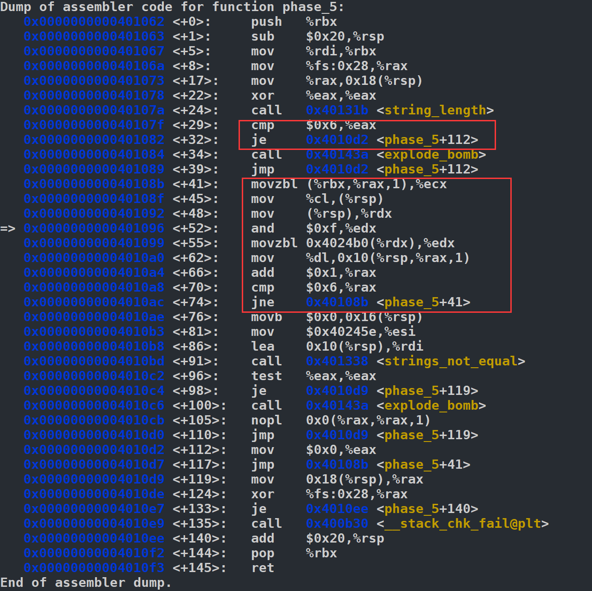

# Phase 1


直接发现phase_1调用了`strings_not_equal`，然后打印地址0x402400处的字符串:

>x/s 0x402400

就出答案了。

# Phase 2

>file bomb

首先也是在`phase_2`打断点：

>b phase_2

然后会读到有个叫`read_six_numbers`的函数，也把他打上断点：

>b read_six_numbers

然后

>run

先输入前阶段答案，然后在step时发现，每次去call `explode_bomb`前，都会有一个比较：


就是cmp指令。然后可以打印一下，我就是一个一个看的，看每次call `explode_bomb`前的跳转条件，发现都是比较%eax和(%rbx)，然后%eax的值看了下前三次触发explode_bomb前是1，2，4，然后我直接猜出来应该输入六个数字了1    2     4     8    16    32，其实后面再乱输一些都是可以的。譬如：

>1 2 4 8 16 32 128309218309 :) abaabaaba

# Phase 3

这个phase_3我没搞清楚，但过的非常快。我输入了

>1 311

就过去了==


首先，第一个`explode_bomb`前有一次cmp，我发现%eax是记录着输入数字的个数，然后要输入大于1个，否则就炸了。


第二次explode前，会发现比较了0x137=311和%eax，所以我第二个输入了311。然后就一直step运行到到call `phase_defuse`了，中间没有call `explode_bomb`。

# Phase 4

首先给`phase_4`打断点，发现第一次call `explode_bomb`前有一个cmpl和jbe：


然后我多试了几次发现0x8(%rsp)就是第一个输入的数字。所以第一个数字要小于等于0xe=12才能逃过第一次explode。

然后如果我们输入一个小于12的数，之后我们会进入一个叫`func4`的函数


由于没有高级语言，我也看不太懂这函数在干嘛，我只知道他在条件跳转跳来跳去。

然后机智的事情出现了，我发现$ecx=7，那么我不想在`func4`里跳来跳去，所以我直接能跳就跳。我发现edi寄存器里存的是输入的最后一个数字，于是我发现第一个输入的数字要小于12，最后一个输入的数字是7就好。


然后回来后，发现最后一次可能爆炸是要求0xc(%rsp)=0。在尝试后我发现0xc(%rsp)存的是第二个输入的数。所以最后只需要输入：

>7 0 1 3 2 7

其中那个1 3 2是我乱写的。重点在第一个和最后一个是7，第二个数字是0。

# Phase 5



首先还是反汇编`phase_5`，发现第一个`explode_bomb`前要要求输入的字母数是0x6。（第一个红框）然后后面下面显然是一个从0到5的循环，然后把你输进去的6位字母每个都操作了下，最后又调用了`strings_not_equal`，判定了下和0x40245e地址里存的字符串一不一样。

首先打印下0x40245e里的字符串：


那么就很轻松了，就是要把你输入的字符串在它操作后变成“flyers”。

我觉得这个phase像表达的是寻址的操作。仔细观看后，会发现它的操作就是把你输入的字母和0xf与一下得到一个offset，然后加上0x4024b0，再把offset+0x4024b0处存的字符输进去，也就是：

>c' = (0x4024b0+(c & 0xf))

然后打印0x4024b0处的内容，发现它是：


显然后面是个提示信息，因此有用的部分是：

> maduiersnfotvbyl

然后我们要的flyers，也就是要与之后的offset是：

> 9 15 14 5 6 7

而a=97，97&0xf=1。

因此我们需要的字符串是：

> ionefg 

因为i=9, o=15, n=14, e=5, f=6, g=7。

# Phase_6

```assembly
00000000004010f4 <phase_6>:
  4010f4:	41 56                	push   %r14
  4010f6:	41 55                	push   %r13
  4010f8:	41 54                	push   %r12
  4010fa:	55                   	push   %rbp
  4010fb:	53                   	push   %rbx
  4010fc:	48 83 ec 50          	sub    $0x50,%rsp
  401100:	49 89 e5             	mov    %rsp,%r13
  401103:	48 89 e6             	mov    %rsp,%rsi
  401106:	e8 51 03 00 00       	call   40145c <read_six_numbers>
  40110b:	49 89 e6             	mov    %rsp,%r14
  40110e:	41 bc 00 00 00 00    	mov    $0x0,%r12d
  401114:	4c 89 ed             	mov    %r13,%rbp
  401117:	41 8b 45 00          	mov    0x0(%r13),%eax
  40111b:	83 e8 01             	sub    $0x1,%eax
  40111e:	83 f8 05             	cmp    $0x5,%eax
  401121:	76 05                	jbe    401128 <phase_6+0x34>
  401123:	e8 12 03 00 00       	call   40143a <explode_bomb>
  401128:	41 83 c4 01          	add    $0x1,%r12d
  40112c:	41 83 fc 06          	cmp    $0x6,%r12d
  401130:	74 21                	je     401153 <phase_6+0x5f>
  401132:	44 89 e3             	mov    %r12d,%ebx
  401135:	48 63 c3             	movslq %ebx,%rax
  401138:	8b 04 84             	mov    (%rsp,%rax,4),%eax
  40113b:	39 45 00             	cmp    %eax,0x0(%rbp)
  40113e:	75 05                	jne    401145 <phase_6+0x51>
  401140:	e8 f5 02 00 00       	call   40143a <explode_bomb>
  401145:	83 c3 01             	add    $0x1,%ebx
  401148:	83 fb 05             	cmp    $0x5,%ebx
  40114b:	7e e8                	jle    401135 <phase_6+0x41>
  40114d:	49 83 c5 04          	add    $0x4,%r13
  401151:	eb c1                	jmp    401114 <phase_6+0x20>
  401153:	48 8d 74 24 18       	lea    0x18(%rsp),%rsi
  401158:	4c 89 f0             	mov    %r14,%rax
  40115b:	b9 07 00 00 00       	mov    $0x7,%ecx
  401160:	89 ca                	mov    %ecx,%edx
  401162:	2b 10                	sub    (%rax),%edx
  401164:	89 10                	mov    %edx,(%rax)
  401166:	48 83 c0 04          	add    $0x4,%rax
  40116a:	48 39 f0             	cmp    %rsi,%rax
  40116d:	75 f1                	jne    401160 <phase_6+0x6c>
  40116f:	be 00 00 00 00       	mov    $0x0,%esi
  401174:	eb 21                	jmp    401197 <phase_6+0xa3>
  401176:	48 8b 52 08          	mov    0x8(%rdx),%rdx
  40117a:	83 c0 01             	add    $0x1,%eax
  40117d:	39 c8                	cmp    %ecx,%eax
  40117f:	75 f5                	jne    401176 <phase_6+0x82>
  401181:	eb 05                	jmp    401188 <phase_6+0x94>
  401183:	ba d0 32 60 00       	mov    $0x6032d0,%edx
  401188:	48 89 54 74 20       	mov    %rdx,0x20(%rsp,%rsi,2)
  40118d:	48 83 c6 04          	add    $0x4,%rsi
  401191:	48 83 fe 18          	cmp    $0x18,%rsi
  401195:	74 14                	je     4011ab <phase_6+0xb7>
  401197:	8b 0c 34             	mov    (%rsp,%rsi,1),%ecx
  40119a:	83 f9 01             	cmp    $0x1,%ecx
  40119d:	7e e4                	jle    401183 <phase_6+0x8f>
  40119f:	b8 01 00 00 00       	mov    $0x1,%eax
  4011a4:	ba d0 32 60 00       	mov    $0x6032d0,%edx
  4011a9:	eb cb                	jmp    401176 <phase_6+0x82>
  4011ab:	48 8b 5c 24 20       	mov    0x20(%rsp),%rbx
  4011b0:	48 8d 44 24 28       	lea    0x28(%rsp),%rax
  4011b5:	48 8d 74 24 50       	lea    0x50(%rsp),%rsi
  4011ba:	48 89 d9             	mov    %rbx,%rcx
  4011bd:	48 8b 10             	mov    (%rax),%rdx
  4011c0:	48 89 51 08          	mov    %rdx,0x8(%rcx)
  4011c4:	48 83 c0 08          	add    $0x8,%rax
  4011c8:	48 39 f0             	cmp    %rsi,%rax
  4011cb:	74 05                	je     4011d2 <phase_6+0xde>
  4011cd:	48 89 d1             	mov    %rdx,%rcx
  4011d0:	eb eb                	jmp    4011bd <phase_6+0xc9>
  4011d2:	48 c7 42 08 00 00 00 	movq   $0x0,0x8(%rdx)
  4011d9:	00 
  4011da:	bd 05 00 00 00       	mov    $0x5,%ebp
  4011df:	48 8b 43 08          	mov    0x8(%rbx),%rax
  4011e3:	8b 00                	mov    (%rax),%eax
  4011e5:	39 03                	cmp    %eax,(%rbx)
  4011e7:	7d 05                	jge    4011ee <phase_6+0xfa>
  4011e9:	e8 4c 02 00 00       	call   40143a <explode_bomb>
  4011ee:	48 8b 5b 08          	mov    0x8(%rbx),%rbx
  4011f2:	83 ed 01             	sub    $0x1,%ebp
  4011f5:	75 e8                	jne    4011df <phase_6+0xeb>
  4011f7:	48 83 c4 50          	add    $0x50,%rsp
  4011fb:	5b                   	pop    %rbx
  4011fc:	5d                   	pop    %rbp
  4011fd:	41 5c                	pop    %r12
  4011ff:	41 5d                	pop    %r13
  401201:	41 5e                	pop    %r14
  401203:	c3                   	ret    
```

首先这个phase好长啊，做了好久不会做。

首先，又看到了`read_six_numbers`我猜是读六个数（废话

其次，仔细读一下开始到0x401151这部分：

```assembly
00000000004010f4 <phase_6>:
  4010f4:	41 56                	push   %r14
  4010f6:	41 55                	push   %r13
  4010f8:	41 54                	push   %r12
  4010fa:	55                   	push   %rbp
  4010fb:	53                   	push   %rbx
  4010fc:	48 83 ec 50          	sub    $0x50,%rsp
  401100:	49 89 e5             	mov    %rsp,%r13
  401103:	48 89 e6             	mov    %rsp,%rsi
  401106:	e8 51 03 00 00       	call   40145c <read_six_numbers>
  40110b:	49 89 e6             	mov    %rsp,%r14
  40110e:	41 bc 00 00 00 00    	mov    $0x0,%r12d
  401114:	4c 89 ed             	mov    %r13,%rbp
  401117:	41 8b 45 00          	mov    0x0(%r13),%eax
  40111b:	83 e8 01             	sub    $0x1,%eax
  40111e:	83 f8 05             	cmp    $0x5,%eax
  401121:	76 05                	jbe    401128 <phase_6+0x34>
  401123:	e8 12 03 00 00       	call   40143a <explode_bomb>
  401128:	41 83 c4 01          	add    $0x1,%r12d
  40112c:	41 83 fc 06          	cmp    $0x6,%r12d
  401130:	74 21                	je     401153 <phase_6+0x5f>
  401132:	44 89 e3             	mov    %r12d,%ebx
  401135:	48 63 c3             	movslq %ebx,%rax
  401138:	8b 04 84             	mov    (%rsp,%rax,4),%eax
  40113b:	39 45 00             	cmp    %eax,0x0(%rbp)
  40113e:	75 05                	jne    401145 <phase_6+0x51>
  401140:	e8 f5 02 00 00       	call   40143a <explode_bomb>
  401145:	83 c3 01             	add    $0x1,%ebx
  401148:	83 fb 05             	cmp    $0x5,%ebx
  40114b:	7e e8                	jle    401135 <phase_6+0x41>
  40114d:	49 83 c5 04          	add    $0x4,%r13
  401151:	eb c1                	jmp    401114 <phase_6+0x20>
```

其实读来读去发现它其实是在判断：

* 输入的六个数互不相同。
* 输入的六个数都小于等于6。

其实应该是一个二重循环，因为我刚开始gdb调试的时候随便输了个1 2 3 4 5 6，然后就没在这部分explode bomb。

我发现跳出这部分唯一一个出口就是0x401130那个判断r12d是不是6，也就是都比较完了，循环变量从0变成6了。

----

然后我打了个断点在出口0x401153，发现它想load一下$rsp+0x18这个地址的值。然而，rsp, rsp+4, rsp+8,...,rsp+20=0x14存的应该是之前输入的六个数字：


也就是他想load一下这六个数后面那个数。（目前还是0）这里我已经猜测这是不是一个struct，而struct里第一个元素就是一个int [6]。

接下来看这个代码片段：

```assembly
  401153:	48 8d 74 24 18       	lea    0x18(%rsp),%rsi
  401158:	4c 89 f0             	mov    %r14,%rax
  40115b:	b9 07 00 00 00       	mov    $0x7,%ecx
  401160:	89 ca                	mov    %ecx,%edx
  401162:	2b 10                	sub    (%rax),%edx
  401164:	89 10                	mov    %edx,(%rax)
  401166:	48 83 c0 04          	add    $0x4,%rax
  40116a:	48 39 f0             	cmp    %rsi,%rax
  40116d:	75 f1                	jne    401160 <phase_6+0x6c>
  40116f:	be 00 00 00 00       	mov    $0x0,%esi
  401174:	eb 21                	jmp    401197 <phase_6+0xa3>
```

然后我发现有个jne这个指令，他每次都会比较%rsi和%rax。而%rsi就是0没动过，%rax从1循环了六次变到6，然后继续增大一个变成了0。在我多次试验下，发现这里就是%rax判断了一遍你输入的数，然后发现都不为0后，就跳出去了。

然后进入下面这段代码：

```assembly
  401176:	48 8b 52 08          	mov    0x8(%rdx),%rdx
  40117a:	83 c0 01             	add    $0x1,%eax
  40117d:	39 c8                	cmp    %ecx,%eax
  40117f:	75 f5                	jne    401176 <phase_6+0x82>
  401181:	eb 05                	jmp    401188 <phase_6+0x94>
  401183:	ba d0 32 60 00       	mov    $0x6032d0,%edx
  401188:	48 89 54 74 20       	mov    %rdx,0x20(%rsp,%rsi,2)
  40118d:	48 83 c6 04          	add    $0x4,%rsi
  401191:	48 83 fe 18          	cmp    $0x18,%rsi
  401195:	74 14                	je     4011ab <phase_6+0xb7>
  401197:	8b 0c 34             	mov    (%rsp,%rsi,1),%ecx
  40119a:	83 f9 01             	cmp    $0x1,%ecx
  40119d:	7e e4                	jle    401183 <phase_6+0x8f>
  40119f:	b8 01 00 00 00       	mov    $0x1,%eax
  4011a4:	ba d0 32 60 00       	mov    $0x6032d0,%edx
  4011a9:	eb cb                	jmp    401176 <phase_6+0x82>
```

在刚进入时，我打印了%rsp地址处的内容和%rsi。会发现：


%rsp处内容就是最后输入的那个数字，%rsi=0。然后，它把输入的最后一个数字拷进了%ecx，和1比较。

显然我们这里%ecx=6触发不了jle，于是执行了把%eax置0，和把%edx置为0x6032d（我打印了该地址的值为332），然后jmp回401176。

这里打印0x6032d地址的内容时，我突然发现前面的尖括号里是<node1>，令人感觉这不会是什么结点吧。


然后出现了最重要的一条指令：mov 0x8(%rdx) %rdx。

我想，%rdx里面存的明明是个地址，那我又去取这个地址偏移0x8的值，而且还是个地址赋给%rdx。然后我执行一步打印后发现：


发现怎么变成node2了，这时候我直接盲猜这是个链表了，而链表结点地址+8就是下个结点的地址。

然后我再这里循环了挺多次（0x40117f那个jne），一直到最后：


我发现一直到node6，node6里面的值就是6(%rdx+4)，正好是我输入的最后一个数，然后就跳到0x401188了。

----

然后我发现它把node6的地址存在了$rsp+32上。他在这里循环了好多次，最后会发现这样的输出结果：


就是%rsp~%rsp+20还存着输入的六个数（倒过来）

然后%rsp+32~%rsp+64存着对应的node地址。但注意，这里找到了第一个1，就直接跳出去了。所以最后没有1。

最后我一阵操作，发现了最后一个explode_bomb的条件：


就是要求(%rbx)比%eax大，而我发现%rbx里的值是443，%eax是477。这就是每个node里面有一个奇怪的值。


然后我直接盲猜要求降序输入这些鬼值，于是我就试了输入3 4 5 6 1 2，然后就炸了。

然后我突然想到，为啥这第一次比较是node6和node5，难道我需要倒过来输入？于是我输入了2 1 6 5 4 3，结果又炸了。

我只好随便换了一组输入，输入是3 5 2 1 6 4，在这个比较前打断点：


输入1 2 3 4 5 6，要求node6的值≥node5的值，这次输入了3 5 2 1 6 4，现在要求node4的值≥node2的值

然后我就找到规律了，应该拿7减一下输入。（当然我也不知道我咋两组就猜出来了，试错成本太低了就随便试试了，否则多换几组数据找规律都找出来了。）

然后我就把3 4 5 6 1 2里每个数都用7去减，得到4 3 2 1 6 5，输入炸弹就defuse了。

# 后记 & secret_phase


因为我几乎所有的过关都是硬试+换数据找规律莫名其妙过去的，做完后我又去百度了下看看有没有大佬能看懂这汇编在干嘛。

后来我发现我不知道百度在干嘛。

但是，百度告诉我我没去看bomb.c这个文件，而且发现有个secret phase这玩意==

因为我习惯都是在gdb里disassemble phase_6导致都没发现这个secret phase。

----

首先看看哪里可以触发`secret_phase`:


这里%rsp+0x10怎么都没法是0x402622里的内容“DrEvil”。

然后我在call strings_not_equal前打了个断点，然后set $rdi=0x402622，然后就可以进入secret_phase了。

然后secret_phase里最主要就是一个递归的fun7函数：

```assembly
0000000000401204 <fun7>:
  401204:	48 83 ec 08          	sub    $0x8,%rsp
  401208:	48 85 ff             	test   %rdi,%rdi
  40120b:	74 2b                	je     401238 <fun7+0x34>
  40120d:	8b 17                	mov    (%rdi),%edx
  40120f:	39 f2                	cmp    %esi,%edx
  401211:	7e 0d                	jle    401220 <fun7+0x1c>
  401213:	48 8b 7f 08          	mov    0x8(%rdi),%rdi
  401217:	e8 e8 ff ff ff       	call   401204 <fun7>
  40121c:	01 c0                	add    %eax,%eax
  40121e:	eb 1d                	jmp    40123d <fun7+0x39>
  401220:	b8 00 00 00 00       	mov    $0x0,%eax
  401225:	39 f2                	cmp    %esi,%edx
  401227:	74 14                	je     40123d <fun7+0x39>
  401229:	48 8b 7f 10          	mov    0x10(%rdi),%rdi
  40122d:	e8 d2 ff ff ff       	call   401204 <fun7>
  401232:	8d 44 00 01          	lea    0x1(%rax,%rax,1),%eax
  401236:	eb 05                	jmp    40123d <fun7+0x39>
  401238:	b8 ff ff ff ff       	mov    $0xffffffff,%eax
  40123d:	48 83 c4 08          	add    $0x8,%rsp
  401241:	c3                   	ret    
```

这个函数很短，很容易读。可以发现他在不断地比较(%rdi)和%esi（你输进去的值），然后根据大小关系去分支改变%rdi，再递归。然后打印%rdi和它相关的内容：


我猜测这就是个二叉树结构==，nxy就表示第x层第y个结点。然后我根本懒得看函数在干嘛，就一个一个值试过去，发现输入22就过了：


这就是全部内容了